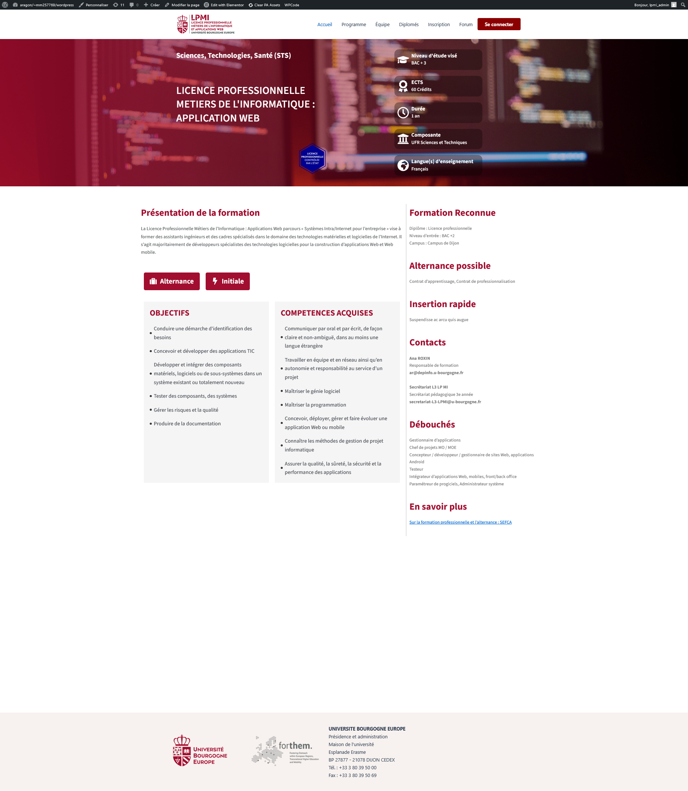

# Projet WordPress LPMI - UBE Dijon

Site web réalisé dans le cadre de ma Licence Professionnelle LPMI à l'Université Bourgogne Europe.

## Aperçu

## Technologies utilisées
- WordPress
- PHP
- CSS / HTML
